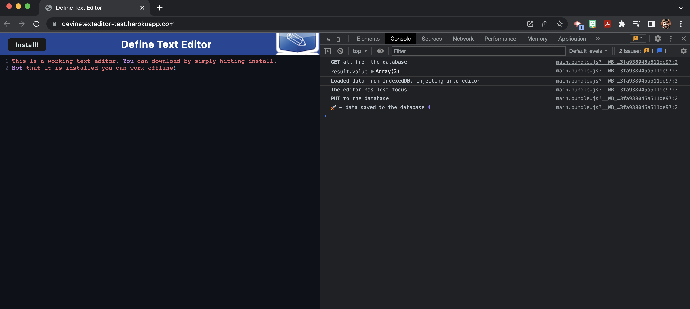
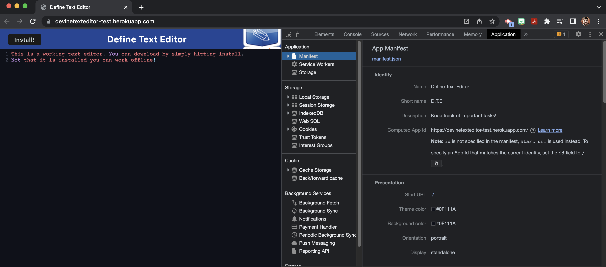
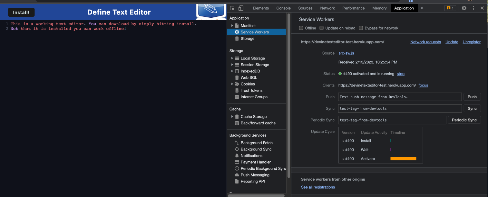
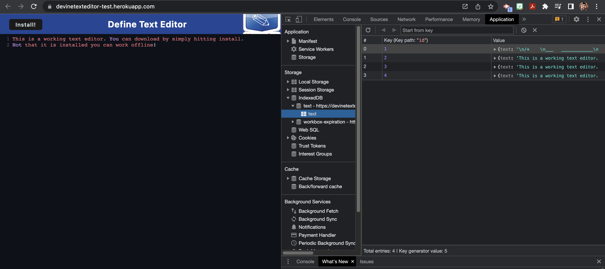

# Define Text Editor

## Description
Define Text Editor is a simpale text editor app that allows you to work online and offline. The application implements methods for getting and storing data to an "IndexDB" database. It also uses "idb" package, a wrapper around the IndexedDB API. As stated above you can download this application to your desktop for offline use. 

## Table of Contents
* [Installation](#installation)
* [Usage](#usage)
* [Contribution](#contribution)
* [Questions](#questions)
* [License](#license)
    
## Installation
To run locally go to: Go to (https://devinetexteditor-test.herokuapp.com/) and click the "install" button to install locally. 

For clone or download: 
* Clone this repository, please note that Node.js is required. 

Run the following commands:
* npm i
* npm run start dev, npm run start in the terminal. 
* Then go to http://localhost:3000/ to run this application. 

## Usage
As stated before the purpose is to be able to use this simple application to write text on and offline. 

## Contribution
If you would like to contribute to this project and would like to reach out my contact information is below.

## Questions
* Checkout my [GitHub profile](https://github.com/jgporter24)
    
* Any additional questions or feed back, feel free to [send an email](mailto:jess.g.porter@gmail.com). 
    
## License
Copyright (c) [jgporter24](https://github.com/jgporter24). All rights reserved.
    
Licensed under the MIT license.
    
  